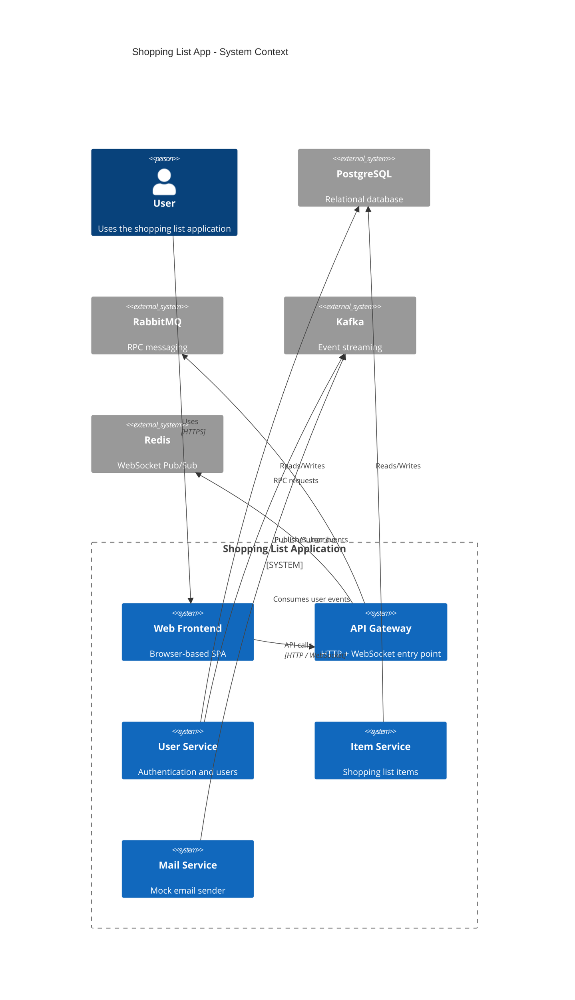
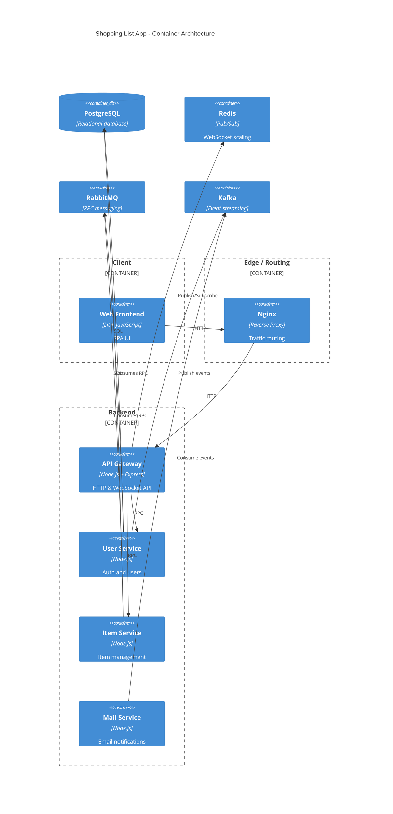

# Shopping List App – Architecture & Documentation

## Overview

This project is a distributed, containerized shopping list application built using a microservices architecture.  
It demonstrates authentication, event-driven communication, real-time updates, and horizontal scalability.

The system consists of:
- A web frontend
- An API gateway
- Multiple backend microservices
- Message brokers for async and RPC-style communication
- Supporting infrastructure services

---

## High-Level Architecture

- **Frontend (Web)**: Lit-based SPA served to the browser
- **API Service**: Central HTTP + WebSocket gateway
- **User Service**: Handles authentication and user management
- **Item Service**: Manages shopping list items
- **Mail Service**: Sends mock emails
- **PostgreSQL**: Persistent storage
- **RabbitMQ**: RPC-style communication between API and services
- **Kafka**: Event streaming between services
- **Redis**: Pub/Sub for WebSocket fan-out
- **Nginx**: Reverse proxy and load balancer
- **Docker Compose**: Orchestration

---

## C4 Diagram – System Context



---

## Container-Level Architecture (C4 – Containers)



---

## Component Responsibilities

### Web Frontend
- Built with Lit (Web Components)
- Handles:
  - Login / signup
  - JWT storage
  - Item creation and updates
  - WebSocket connection for real-time updates
- No business logic

### Nginx
- Reverse proxy
- Load balances requests to API replicas
- Single public entry point

### API Service
- Express-based gateway
- Handles HTTP, WebSockets, JWT verification, Redis Pub/Sub
- Stateless

### User Service
- Owns users and authentication
- PostgreSQL-backed
- Publishes user-created events to Kafka

### Item Service
- Owns shopping list items
- PostgreSQL-backed
- Horizontally scalable

### Mail Service
- Consumes Kafka events
- Sends mock emails

---

## Communication Patterns

- HTTP: Browser to API
- RabbitMQ RPC: API to services
- Kafka events: Service-to-service
- WebSockets + Redis: Real-time updates

---

## Authentication Flow


---

## Item Update Flow


---

## Running the App

```bash
docker compose up --build
```

- Web UI: http://localhost:8000
- API: http://localhost
- RabbitMQ UI: http://localhost:15672

---
