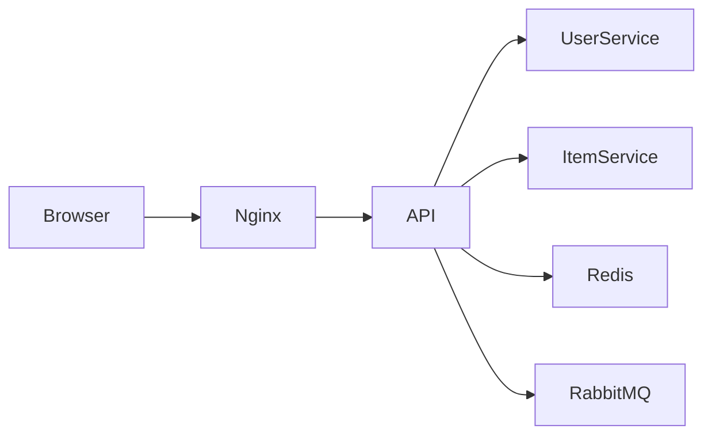

# Tutorial: Using Nginx as a Reverse Proxy in a Microservices Architecture

## Introduction

This tutorial explains how Nginx is used in the Shopping List application to act as a reverse proxy and gateway in a microservices-based system. The goal is to demonstrate why Nginx is useful, how it fits into the overall architecture, and how it is configured to route traffic reliably between the frontend and backend services.

By the end of this tutorial, you will understand:
- What a reverse proxy is and why it is needed
- How Nginx fits into the application architecture
- How requests flow through Nginx
- How the Nginx configuration works
- Common issues and best practices when using Nginx with Docker

This tutorial assumes basic familiarity with Docker, HTTP, and web applications.

---

## 1. Why Use Nginx in This Application

In a microservices architecture, applications are composed of multiple independent services. In this project, those services include:
- A web frontend
- An API gateway
- User, item, and mail services
- Infrastructure services such as PostgreSQL, Redis, RabbitMQ, and Kafka

Exposing every service directly to the browser would be insecure and difficult to manage. Instead, Nginx is used as a single entry point for HTTP traffic.

Nginx provides the following benefits:
- Centralized request routing
- Load balancing
- Improved security through service isolation
- Simplified frontend configuration
- Better control over timeouts and headers

---

## 2. High-Level Request Flow

When a user interacts with the application, requests follow this path:

1. The browser sends an HTTP request to `http://localhost`
2. Nginx receives the request on port 80
3. Nginx forwards the request to the API service
4. The API service communicates with backend services via RabbitMQ or Redis
5. The response travels back through Nginx to the browser

Nginx acts as a reverse proxy, meaning it forwards client requests to internal services and returns their responses transparently.

---

## 3. Nginx in the Application Architecture

At a high level, the architecture looks like this:



The browser never communicates directly with internal services. Only Nginx is exposed externally.

---

## 4. Nginx and Docker Networking

All services in the application run inside Docker containers connected to the same Docker network. Docker provides automatic DNS resolution, allowing services to refer to each other by container name.

For example:
- The Nginx container can reach the API container using the hostname `api`
- The API container listens on port `3000`

This allows the Nginx configuration to remain simple and stable, even if container IP addresses change.

---

## 5. Nginx Configuration Explained

Below is the Nginx configuration used in the project:

```nginx
upstream api_servers {
    server api:3000;
    server api:3000;
    server api:3000;
}

server {
    listen 80;

    location / {
        proxy_pass http://api_servers;
        proxy_set_header Host $host;
        proxy_set_header X-Real-IP $remote_addr;
        proxy_set_header X-Forwarded-For $proxy_add_x_forwarded_for;
        proxy_set_header X-Forwarded-Proto $scheme;
        proxy_set_header Upgrade $http_upgrade;
        proxy_set_header Connection "upgrade";
    }
}
```

### 5.1 Upstream Block

The `upstream` block defines a group of backend servers. Even though all entries point to the same API service, Nginx treats them as separate targets.

This enables:
- Basic load balancing
- Future horizontal scaling without changing configuration

If multiple API containers are deployed, Nginx will distribute traffic between them.

---

### 5.2 Server Block

The `server` block defines how Nginx listens for incoming requests.

- `listen 80` instructs Nginx to accept HTTP traffic on port 80
- The `location /` block matches all incoming paths

---

### 5.3 Proxy Headers

The `proxy_set_header` directives ensure that important request information is preserved:

- `Host` keeps the original hostname
- `X-Real-IP` and `X-Forwarded-For` pass the client IP
- `X-Forwarded-Proto` indicates whether HTTPS was used
- `Upgrade` and `Connection` allow WebSocket connections

These headers are essential for authentication, logging, and WebSocket support.

---

## 6. WebSockets and Nginx

The application uses WebSockets to update the shopping list in real time when items are added or updated.

Nginx must explicitly support WebSocket upgrades. This is handled by:

```nginx
proxy_set_header Upgrade $http_upgrade;
proxy_set_header Connection "upgrade";
```

Without these headers, WebSocket connections would fail or disconnect unexpectedly.

---

## 7. Handling Timeouts and Reliability

Nginx protects the frontend from backend instability. If the API service is temporarily unavailable:
- Nginx returns a controlled error response
- The browser does not need to know about internal service failures

This separation makes the system more resilient and easier to debug.

---

## 8. Common Issues and Solutions

### 8.1 504 Gateway Timeout

A 504 error usually means:
- The API service did not respond in time
- RabbitMQ or another dependency was unavailable

Solution:
- Check backend service logs
- Ensure dependent services are healthy before starting Nginx

---

### 8.2 CORS Errors

Because all browser requests go through Nginx, CORS issues are minimized. The API only needs to allow requests from the web frontend origin.

This is simpler than configuring CORS for multiple exposed services.

---

## 9. Best Practices

- Always place Nginx in front of internal services
- Avoid exposing backend containers directly
- Use Docker service names instead of IP addresses
- Configure WebSocket headers explicitly
- Keep Nginx stateless

---

## 10. Conclusion

Nginx plays a critical role in the Shopping List application by acting as a stable, secure, and flexible gateway. It hides internal complexity from the browser, enables scaling, and simplifies communication between services.

Understanding how Nginx works in this context provides a strong foundation for building and operating microservices-based systems.

This pattern can be extended to production environments with HTTPS, advanced load balancing, and security features.
